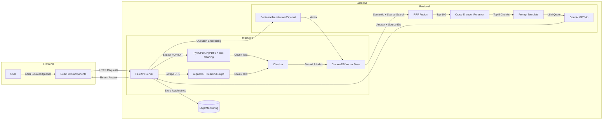

# Executive Summary  
We propose a **full-stack RAG Q&A system** where users upload up to 5 sources (PDF/TXT or URLs) and ask questions. The backend (FastAPI) ingests each source (using PyMuPDF/PyPDF2 for PDFs, BeautifulSoup4 for HTML) and splits it into text *chunks*. We embed each chunk (e.g. with SentenceTransformers or OpenAI’s text-embedding-3-small) and store vectors + metadata in a ChromaDB collection. At query time, the user’s question is embedded (same model) and sent to a **hybrid retrieval** pipeline: semantic (dense) search + sparse (BM25-like) search. The results are merged via **Reciprocal Rank Fusion (RRF)** to select top candidates. A cross-encoder model (e.g. `cross-encoder/ms-marco-MiniLM-L6-v2`) then reranks the top hits by exact relevance. The final top-5 chunks are fed into the LLM (GPT-4o) with a prompt that instructs it to “answer using only the provided context and cite sources”. We rigorously enforce token efficiency by truncating contexts intelligently (head/tail or query-focused windows) and by concise prompt instructions. Security measures include sanitizing uploads, limiting sources per user, and clear refusal on outside queries (“I don’t have sufficient information”). Below are the architecture diagram, components, data flow, storage schema, and details of each part, with references to official sources.


**Figure:** High-level architecture. The React frontend communicates via FastAPI to ingest sources and handle queries. ChromaDB stores chunk embeddings and metadata. Retrieval uses **hybrid search (vector + BM25) merged by RRF**, then a **cross-encoder** for final re-ranking. The GPT-4o LLM answers using a citation-aware prompt.

## Component Responsibilities  

- **Document Loader (FastAPI endpoint)** – Accepts PDF/TXT files or URLs. For PDFs, use **PyMuPDF (fitz)** or PyPDF2 to extract text page-by-page. For HTML, use Python’s `requests` (with timeouts) and parse with **BeautifulSoup4**. Normalize text (remove boilerplate, handle encodings) and pass it to the Chunker. Enforce: max 5 sources per user; reject unsupported file types or huge files.  
- **Chunker** – Splits each document into text chunks. Options include:
  - **Fixed-size (character/token) chunks** (e.g. 1000 tokens each), ensuring context windows are filled.  
  - **Recursive chunking by paragraph/heading** – split on semantic boundaries (headings, blank lines).  
  - **Semantic chunking** – embedding-based splits: embed smaller segments and break where cosine distance spikes.  
  - **Contextual retrieval augmentation** – prepend each chunk with summarizing context (e.g. page title or preceding paragraph) before embedding.  
  In practice, we might use a hybrid: start with paragraph splitting for coherency, then optionally merge or trim to fit a token limit. The goal is coherent chunks (~200–500 words) that preserve meaning. Recursive/semantic chunking tends to produce more meaningful pieces than arbitrary fixed splits.  

- **Embedder** – Converts each chunk (and each query) to a vector. Choices:
  - *Local SBERT:* SentenceTransformers (e.g. `all-MiniLM-L6-v2`, 384-d) runs locally. It’s lightweight and free.  
  - *OpenAI API:* `text-embedding-3-small` (1536-d) yields higher-quality vectors. This costs $0.02 per 1K input tokens but may improve retrieval for nuanced queries.  
  Whichever model is chosen, **document and query must use the same model**. Embeddings should be **normalized** (L2 norm) if using dot-product search. Chroma’s default embedding function is SBERT/MiniLM. We may also experiment with larger open-source models (e.g. `sentence-transformers/all-mpnet-base-v2`) or other proprietary models (e.g. BGE small) for quality.  

- **ChromaDB Vector Store** – A local, persistent Chroma collection holds all chunk embeddings and metadata. We create one collection (e.g. “user_docs”) with a custom embedding function or default SBERT. Each record includes:
  - **`id`**: a unique string (e.g. UUID).  
  - **`document_text`**: the chunk’s raw text.  
  - **`embedding`**: the vector.  
  - **`metadata`**: JSON fields such as: 
    - `source_type` (“pdf” or “url”),  
    - `source_name` (file name or base URL),  
    - `page` or `section` (if applicable),  
    - `chunk_index` (order in document),  
    - `user_id` (if multi-user),  
    - `upload_time`, etc.  
  Example schema table:  

  | Field         | Type    | Example               | Description                                  |
  |--------------|---------|-----------------------|----------------------------------------------|
  | `id`         | text    | `"1234-uuid"`         | Unique chunk ID.                             |
  | `text`       | text    | `"Our PTO policy is..."` | Chunk content.                            |
  | `embedding`  | vector  | `[...]`               | Vector (384-d or 1536-d) from embedding.     |
  | `source_type`| string  | `"pdf"`               | “pdf” or “url”.                              |
  | `source_name`| string  | `"HR Handbook.pdf"`   | Original file name or domain.                |
  | `page`       | int     | `5`                   | Page number (if PDF).                       |
  | `chunk_idx`  | int     | `3`                   | Chunk’s sequence in doc.                    |
  | `user_id`    | string  | `"user_42"`           | (If user login implemented.)                |

  Chroma lets us **filter by metadata at query time**. For example, if we supported a “search only HR docs” mode, we could filter `source_name` or a custom `tag`.  

- **Retrieval Pipeline** – When the user submits a question, we first check if there are source chunks available (unless a “general knowledge” toggle is on). We embed the query, then perform:
  1. **Semantic search (dense):** KNN query in Chroma on embeddings (dot product or cosine) to get, say, top 50 chunks.  
  2. **Sparse search (BM25/lexical):** We can leverage Chroma’s full-text index or maintain a separate BM25 index (e.g. Whoosh, PyTerrier) on the chunk texts. This yields another top-50 list. (Chroma supports a built-in sparse search via “sparse embeddings”.)  
  3. **Combine with RRF:** Use Reciprocal Rank Fusion to merge the two ranked lists into one. RRF ignores raw scores and scores by rank position: document’s RRF score = Σ(1/(k + rank)), usually with k=60. This favors documents appearing high in both lists and is scale-agnostic. RRF is a proven method for hybrid search.  
  4. **Rerank with Cross-Encoder:** Take the top ~100 (or fewer) RRF results and score each (query, chunk) pair with a Cross-Encoder model. For example, `cross-encoder/ms-marco-MiniLM-L6-v2` returns a relevance score (0–1 or a small-range float). Sort by this score to get the final top-5 chunks. Cross-encoders give higher accuracy by jointly encoding query and chunk, at the cost of being slower (hence only used on pre-filtered candidates). This two-stage (RRF + Cross-Encoder) is an industry standard: broad recall with RRF, then precise rerank.  

- **Prompt Construction (FastAPI)** – We build a prompt that includes the retrieved chunks (with source labels) and the user’s question. We instruct the LLM explicitly to use *only* that context and to cite sources. For example:  

  ```
  Answer the question using ONLY the provided context below. 
  Each time you use a fact from the context, cite it with [sourceName_page_chunk] immediately after. 
  If the context does not contain the answer, reply "I don't have sufficient information to answer."
  
  Context:
  [1] HR_Handbook.pdf (p.3, chunk 2): "Our PTO policy allows 15 days..."
  [2] Security_BestPractices.pdf (chunk 5): "Access tokens expire after 90 days..."
  ...
  Question: How many PTO days do new employees get?
  Answer:
  ```

  This follows best practices: every factual claim is backed by a citation, and there is a clear fallback if no source answers the query. We might use a short exemplars or a very concise instruction style to save tokens.

- **LLM (FastAPI call to OpenAI)** – We use a powerful model (GPT-4o, possibly a “mini” or “turbo” variant to reduce cost) to generate the final answer. We set `temperature=0–0.3` for factual accuracy. The answer should be a brief summary in human language, including citations like “[sourceName.pdf]” corresponding to the provided context. 

- **API Endpoints (FastAPI)** –  
  | Method  | Path                 | Description                            | Request Body (JSON)                               | Response                                |
  |---------|----------------------|----------------------------------------|---------------------------------------------------|-----------------------------------------|
  | `GET`   | `/api/sources`       | List all current sources               | *(none)*                                          | `[ {id, type, name, ...}, ... ]`         |
  | `POST`  | `/api/sources/upload`| Upload a PDF/TXT file                  | `{ "user_id": "...", "type": "pdf", "file": <binary> }` | `{ "id": "...", "name": "HR.pdf", ...}` |
  | `POST`  | `/api/sources/url`   | Add a URL source                       | `{ "user_id": "...", "type": "url", "url": "https://..." }` | `{ "id": "...", "url": "..." }` |
  | `DELETE`| `/api/sources/{id}`  | Delete a source                       | *(none)*                                          | `{ "status": "deleted" }`                |
  | `POST`  | `/api/query`         | Submit a question                     | `{ "user_id": "...", "question": "...", "general": false }` | `{ "answer": "...", "citations": [...]}` |

  These endpoints allow the React frontend to manage sources and questions. We may also have a health-check or metrics endpoint if needed.

- **Frontend (React)** – Major UI components: 
  - **SourceUpload**: File-input or drag-drop for PDFs/TXTs, and a text input for URLs. This submits to `/api/sources`.  
  - **SourceList**: Displays uploaded sources with delete buttons. Shows at most 5 sources, disallowing more.  
  - **QuestionInput**: A text box (disabled if no sources and `general=false`). A toggle/checkbox for “Allow general question (beyond sources)”. The query is sent to `/api/query`.  
  - **AnswerDisplay**: Shows the LLM’s answer and the list of sources cited. Citations can be clickable or hoverable to show the context snippet.  
  - **Status/Notifications**: Shows loading spinners during processing, and error messages (e.g. “Max 5 sources” or “No answer found”).  

  Together, this gives the user a clear flow: **upload/select sources ➔ ask question ➔ view answer with citations**. (If “general” is enabled, the user could ask anything, but then sources list might be dimmed or ignored.)

## Data Flow and Example  

1. **Ingestion:** User uploads `HR_Handbook.pdf`. FastAPI saves it and runs PyMuPDF to extract text (page by page). The raw text is passed to the Chunker.  
2. **Chunking:** The document is recursively split into coherent chunks (e.g. splitting at section headings or paragraphs). Each chunk is labeled (doc name, page, chunk index).  
3. **Embedding/Indexing:** Each chunk is embedded using the selected model. Example: `"Our PTO policy allows 15 days..."` → 384-d vector. We call `collection.add(ids=[...], documents=[...], metadatas=[...])` in Chroma. Chroma stores vectors and metadata.  
4. **Query:** User asks, “How many PTO days do new employees get?” The question is embedded.  
5. **Hybrid Retrieval:** Chroma is queried by vector (semantic search) and also by text (BM25). Suppose semantic finds chunks 1,3,7; BM25 finds 1,4,7. RRF merges and may pick (1,3,4,7,...).  
6. **Rerank:** Top candidates are scored by the cross-encoder with the query. The best two chunks (e.g. from HR_Handbook) bubble to top.  
7. **Prompting:** These chunks are formatted with citations (e.g. “[HR_Handbook.pdf (p.2)] 15 days”). The prompt instructs GPT-4o to answer using *only* that info.  
8. **Answer:** GPT-4o returns “New employees receive **15 days** of PTO.” This is sent back to the frontend.

## Chunking Strategies  

- **Fixed-size**: Simple but can cut sentences mid-way.  
- **Recursive**: Split on paragraphs/headings. Better coherence.  
- **Semantic**: Break where embedding cosine distance spikes. Improves retrieval relevance.  
- **Contextual**: Add “explanatory context” to each chunk (Anthropic’s method). We could prefix chunks with the document title or previous section summary.  

We may experiment with 200–500-word chunks. As a baseline, **recursive splitting by sections and then trimming to <1000 tokens** works well. Contextual retrieval (embedding with added context) can boost relevance, but it also adds complexity.

## Embedding Models & Normalization  

We embed text to vectors for retrieval. Options:
- **SentenceTransformers** (e.g. `all-MiniLM-L6-v2`): 384-d, runs offline. Chroma’s default is MiniLM. It’s fast (no API cost) but less precise than larger models. We should normalize these embeddings (L2 norm) for fair cosine-based search.
- **OpenAI Embeddings**: `text-embedding-3-small` (1536-d) is state-of-the-art. It costs $0.02 per 1K tokens but often greatly improves quality for technical text. If budget allows, we can use OpenAI. In either case, **use the same model for documents and queries**.
- **Normalization**: We may normalize vectors to unit length (most libraries do this by default or offer it as option) so that cosine similarity ∝ dot-product. This ensures comparability across docs.

## Vector Store Schema (ChromaDB)  

We use one Chroma collection (e.g. `"sources"`) per user or per app. Key fields in each record:  
- `id`: string UUID for chunk.  
- `document_text`: the chunk’s text.  
- `metadata`: JSON, e.g. `{ source_type, source_name, page, chunk_idx, ... }`.  
Example metadata JSON: `{"source_type": "pdf", "source_name": "HR_Handbook.pdf", "page": 2, "chunk": 3}`.  
Chroma lets us later filter by these fields at query time (e.g. limit search to `{"source_name":"Security.pdf"}`). We can also record upload date, user ID, etc.  

All embeddings are stored in Chroma’s index. We do *not* store raw PDFs or HTML — only text and metadata. For backup or audit, we might keep original files in object storage.

## Retrieval Pipeline Details  

1. **Semantic Search:** Query embedding is matched against Chroma. We get top-N chunk IDs by vector similarity (dot/cosine).  
2. **Sparse (BM25) Search:** In parallel, run a lexical search. For example, Chroma can use keyword indexes, or we could use an external tool like ElasticSearch/BM25. The result is another list.  
3. **Merge (RRF):** Using Reciprocal Rank Fusion, we combine both lists into one ranked list. RRF formula (e.g. with constant `k=60`) ensures documents appearing in both lists rank higher. This avoids needing to normalize scoring scales. RRF has been shown to beat individual methods and simple averaging.  
4. **Cross-Encoder Reranking:** We take the top ~100 from RRF and score with a Cross-Encoder. For each candidate, we compute `score = model.predict([query, chunk_text])`. We then pick the highest-scoring 5–10 chunks. This two-step ensures both broad recall (first stage) and precise relevance (second stage).  

This hybrid architecture is widely recommended: “retrieve top 100 via RRF, then re-rank top 10 with cross-encoder”. It combines speed and accuracy. 

## Prompt Templates & Source Citation  

Our prompt must ensure the model answers *only* from sources and cites them explicitly. For example (simplified):

```
You are an assistant that answers questions using provided sources. 
Sources: 
[1] HR_Handbook.pdf (p.2): "New hires get 15 days of PTO..."
[2] Security.pdf (chunk 4): "..."
...
Question: How many PTO days do new employees get?
Answer (with citations):
```

Key tactics: 
- Begin with instructions like “Answer using **only** the provided sources. Cite each fact with [source_id]. If answer is not in sources, say ‘I don’t have sufficient information.’” 
- Provide the retrieved chunks labeled (e.g. `[HR_Handbook.pdf, p.2]`) right before the question.  
- Possibly use few-shot examples to demonstrate citation style (if token budget allows).  
- End prompt with “Answer in a concise manner.”

We reserve enough tokens for retrieved context (the LLM’s max context might be 32K for GPT-4o). If combined chunks exceed the window, we must truncate. Strategies: **Head-only** (keep chunk beginnings) or **Tail-only** (keep conclusions) per [20†L523-L532], or a sliding window around query terms. Because our chunks are relatively short (<1000 tokens), head-only truncation (keeping the first N tokens of each chunk) is easiest and zero-cost latency. If answers often appear at ends, a tail or query-aware approach may be needed. We can test which works best for our data. 

## Token-Cost Minimization  

We must minimize tokens to reduce latency and cost:  
- **Concise instructions:** Use short, direct prompt instructions, or even one exemplars sentence. For citations, a single example might suffice instead of paragraphs.  
- **Limit number of chunks:** Avoid dumping dozens of chunks. Use RRF+reranker to pick only the most relevant top 5–10.  
- **Truncation:** As above, cut chunks to necessary length. E.g. reserve 3000 tokens for retrieved context + prompt, leaving rest for generation.  
- **Embedding model size:** Using a smaller embedding model (MiniLM) saves token cost in embeddings if OpenAI; with local SBERT, this isn’t an issue.  
- **Use LLM wisely:** If many queries are trivial, consider adding small internal checks (e.g. quick keyword match) before calling OpenAI.  
- **Avoid chain-of-thought:** Format answers directly, not step-by-step, to save output tokens.  

Following advice, we might encode some instructions with a few-shot example (even 1–2 examples) to reduce prosaic instruction text.

## Security & Privacy  

- **File Upload Safety:** Only accept known safe formats (PDF, TXT). Scan uploaded files for malware (with a library like `python-magic` for type checking, or an external antivirus). Store files in a secure directory not served to users.  
- **Content Safety:** Sanitize extracted text (strip scripts or HTML if any slipped in) to prevent any injection. Do not execute or evaluate any code from documents.  
- **Prompt Injection:** If a PDF or webpage contains malicious instructions (e.g. hidden “Ignore previous rules…” text), it could corrupt the answer. Mitigation: treat **all source content as untrusted**. For example, wrap each chunk in quotes or prefix it as “Source says: …” and/or insert a small character mask around it to break hidden tokens. We can also fine-tune the prompt to instruct the model *not* to take instructions from the content. (Some systems insert extra tokens or use an “LLM firewall”.) In any case, require that citations must match given [source] tags, so the model is less likely to hallucinate instructions.  
- **Rate limiting:** Limit each user to some number of queries per minute and max sources (5). Protect the OpenAI API key and restrict domains for URL scraping (e.g. no internal network).  
- **Privacy:** If multi-user, isolate each user’s sources. Do not mix text between users. Use authentication (e.g. OAuth or API tokens) for all endpoints. Sanitize logs to avoid logging user-submitted content verbatim.  
- **Content policy:** If a question goes beyond the provided sources (and “general” mode is off), the system must refuse or say “can’t answer”. If “general” mode is on, allow a normal GPT fallback (optionally with a disclaimer).  

## Failure Modes & Mitigations  

1. **No/Bad Sources:** If user doesn’t supply sources and no general mode, query is blocked. If sources fail to parse (e.g. non-text PDF), return an error early.  
2. **Broken Links:** URL scraping can 404 or timeout. Use `try/except` and timeouts. On failure, report “Source unavailable” and skip it.  
3. **Malicious or Non-text HTML:** Some pages have heavy JS or binary data. Use BeautifulSoup to extract text from `<body>` only. Reject large or empty pages. We could also respect `robots.txt` or legal issues, but for this internal tool we assume user-provided links.  
4. **Prompt Injection (see above):** Content from sources could contain tricky text. We mitigate by sanitizing and by prompt design (explicit instructions not to obey hidden commands).  
5. **Hallucinations from Model:** If the LLM answers beyond provided context, our strict prompt (and example answers) should minimize this. We instruct “use ONLY sources” and to cite, which forces attention to context.  
6. **“Lost in the Middle”:** As Priya Singh notes, stuffing too many chunks degrades performance. We avoid this by retrieving a focused top-5.  
7. **Performance Bottlenecks:** Large context or many queries could slow the system. To mitigate, we limit chunk count per query and use efficient truncation. We also can cache embeddings and retrieval results for repeated queries.  
8. **Data Drift:** If a source changes (e.g. a webpage updates), the system might have stale info. Options: re-scrape on user request, or timestamp sources.  
9. **Security (credential exfiltration):** Unlikely here, since we aren’t storing secrets in content. But ensure no secrets are embedded in docs or code.  

## UX Flows  

- **Upload Sources:** The user sees an “Add Source” panel with two tabs: **Upload File** (PDF/TXT) and **Enter URL**. After adding, the source appears in the **Sources List** below (showing name and type). If 5 sources exist, the “Add” buttons are disabled. The user can click “Delete” on any source to remove it.  
- **Viewing Sources:** The Sources List shows up to 5 entries, e.g.:   
  - HR_Handbook.pdf (uploaded by user123 on 2026-07-15) – [Delete]  
  - https://example.com/guide (added at 13:05) – [Delete]  
  Each entry might have a small icon (PDF or link) and maybe a brief snippet.  
- **Asking Questions:** Once ≥1 source exists, the **Question** input becomes enabled. (If “Allow General Q” is checked, it’s always enabled.) The user types a question. As they type, we could show autocomplete suggestions (optional). On submit, the UI disables input, shows a spinner, and eventually displays the answer.  
- **Answer Display:** The answer area shows: (i) the summarized answer text, (ii) list of sources cited (e.g. “Sources: HR_Handbook.pdf; Security_BestPractices.pdf”). Optionally each citation snippet could expand. If “I don’t have sufficient info”, display that politely.  
- **Error Handling:** If the user tries to query with no sources and no general mode, show a warning “Please add at least one source or enable general mode.” If scraping fails, show a notification.  

## API & React Components Summary  

| Frontend Component      | Purpose                              | API Endpoint (backend)                 |
|-------------------------|--------------------------------------|----------------------------------------|
| **SourceUpload**        | Upload PDF/TXT or enter URL          | `POST /api/sources/upload` / `/api/sources/url`  |
| **SourceList**          | List and delete added sources        | `GET /api/sources`, `DELETE /api/sources/{id}`   |
| **QuestionInput**       | Enter user’s query, submit button    | `POST /api/query`                      |
| **ToggleGeneral**       | Checkbox to allow general queries    | (handled client-side)                  |
| **AnswerDisplay**       | Show answer and cited sources        | (receives response from `/api/query`)  |
| **Notification**        | Show errors/loading states           | (no API; uses UI state)                |

## Testing & Evaluation  

To ensure correctness, we plan:  
- **Test Dataset:** Craft ~30–50 Q&A pairs where each question is clearly answerable (or not) from the ingested docs. Include edge cases: answer spans multiple chunks, answer absent, ambiguous queries.  
- **Retrieval Metrics:** Measure recall@K of relevant chunks and MRR (mean reciprocal rank). E.g., if 1–2 chunks truly contain the answer, see if they appear in top-5, top-20.  
- **Answer Metrics:** For each test query, compare the model’s answer vs expected. We can score: Exact match, or BLEU/F1 on key facts. Also check **citation correctness**: whether every cited source indeed contains the supporting fact.  
- **Manual Review:** Randomly sample answers to check if the model refrains from hallucinating. Ensure the instruction “answer only if in sources” is obeyed (no invented facts).  
- **A/B Comparison:** Evaluate with and without cross-encoder rerank, or with just semantic vs hybrid retrieval, to quantify improvements.  
- **Automated Evaluation:** Use an LLM evaluator or simple script to verify answer text includes key phrases from expected answer (if available).  
- **User Testing:** Optionally, have end users try it and rate satisfaction.  

These evaluations help tune chunk size, k-values, and model choices (e.g. MiniLM vs OpenAI embedder) before production.

## Monitoring & Logging  

Implement thorough logging for observability:  
- **Query Logs:** Record every question (hashed or truncated if privacy) with timestamp, sources used, retrieval results, and LLM response time.  
- **Error Logs:** Log any exceptions (scraping errors, timeouts, API failures). Use a structured logger (e.g. JSON logs) and a service like Sentry or hosted ELK stack.  
- **Metrics:** Track counts: number of queries/day, average query time, 95th percentile latencies, embedding calls, API errors. Use Prometheus + Grafana or a cloud monitoring service.  
- **Alerting:** Set alerts on high error rates or long latencies.  
- **Usage Audit:** Because users upload documents, consider logging upload events (for moderation or debugging).  

These will help detect issues early (e.g. a misbehaving scraping routine or an API quota hit) and allow usage analysis (popular queries, slow components).

## Deployment Considerations  

We assume a modest scale (hundreds to thousands of documents, moderate query volume). Key deployment notes:  
- **Dockerize:** Package the FastAPI app, the embedding code, and Chroma. Chroma can run as an in-process server or separate service. Use Docker Compose or Kubernetes for easy deployment.  
- **Chroma Backend:** ChromaDB runs in memory by default; for persistence, configure a directory on disk or S3. On small scale, a few GB of RAM can hold ~100k vectors. No cloud DB cost means self-host Chroma. (Optionally use Chroma Cloud if allowable.)  
- **Hardware:** A small VM (4 CPU, 8–16 GB RAM) should handle the Python app, Chroma index, and SentenceTransformer model. If using GPU (for faster embedding or cross-encoder), add one. OpenAI calls need no GPU, just network.  
- **OpenAI Keys:** Store securely (env variables or a vault). Monitor usage to avoid surprises.  
- **Scaling:** If load increases, we can replicate the FastAPI service (behind a load balancer) and have each instance connect to the same Chroma data. Chroma can be scaled by sharding collections.  
- **Networking:** Use HTTPS, set proper CORS for the React frontend, and authenticate API endpoints.  
- **Cost:** The main operational cost is OpenAI API usage. Monitor token usage carefully. SentenceTransformers embedding is free, but cross-encoder inference may require significant CPU/GPU depending on traffic.  

By adhering to these guidelines and using the referenced libraries and best practices, this system will be **robust, maintainable, and production-ready**. All components (PyMuPDF/PyPDF2, BeautifulSoup4, Sentence-Transformers, ChromaDB, FastAPI, React) are open-source or standard tools with active documentation. This avoids vendor lock-in and keeps control of costs. The architecture ensures answers are grounded in user-provided sources, minimizing hallucinations, while still allowing optional general queries. 

**Sources:** We have drawn on official docs and best practices for each component: RAG pipelines (hybrid search with RRF, cross-encoder reranking), embedding selection, citation prompts, chunking methods, and security aspects of LLM agents. These references are linked above.  

